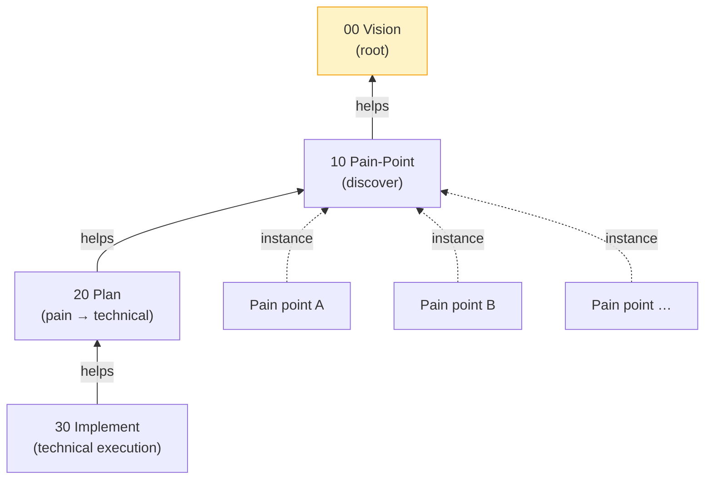

# 00 — Vision

**Layer expertise.** Why this endeavor exists and what counts as success. The root that everything else aligns to.

**Mandate.** Define the endeavor's purpose, scope, hard constraints, and cross-cutting concerns.

**Knowledge.** Founder intent, the Layered Endeavor Framework, the broad domain of physiological-signal understanding (cardiac + neural).

**Output.** This document.

**Help target.** None (root layer).

---

## Endeavor tree

Vision is the root of alignment. Each downstream layer (`10` → `20` → `30`) helps the layer above. Each pain point exists as a folder inside whichever layers it has reached (e.g., admitted = present in `10` and `20`; running = present in `10`, `20`, `30`).

## Why this endeavor exists

Resolve **real pain points** in AI-assisted heart-brain understanding — the use of physiological signals (heart and brain) to infer body state, mental state, or intent.

Domain spans (non-exhaustive): ECG / PPG / HRV; EEG / MEG / fNIRS; sleep staging; affective state inference; cognitive load; intent decoding (BCI); arrhythmia detection; biomarker discovery; cross-subject generalization; cross-dataset robustness; multimodal heart-brain fusion.

## Portfolio, not single-shot

The endeavor maintains a **portfolio** of pain points — explored sequentially or in parallel as resources permit. Every admission to the portfolio must independently pass the hard constraints; the portfolio is gated by quality, not capped by count.

**Reuse is first-class.** Anything plausibly useful across tracks gets promoted into a layer's `shared/` subfolder with a small spec. Each layer owns its own `shared/`: `10-pain-point/shared/` (portfolio registry, validation log, historical critic outputs), `20-plan/shared/` (reuse sketches, cross-track design notes), `30-implement/shared/` (data loaders, eval utilities, baselines).

## Who we serve (candidate constituencies)

Researchers · clinicians · BCI users · wearable developers · end users (patients, consumers) · ML model developers working on biosignals.

Vision does not pre-commit to a constituency. The pain-point layer (10) admits constituencies into the portfolio one at a time, evidence-gated.

## Hard constraints (non-negotiable, per pain point)

Apply independently to every pain point admitted to the portfolio. Each constraint is enforced at the layer that can actually verify it:

1. **Pain-point real and validated.** Some constituency genuinely feels it; we have evidence. *Enforced at layer 10 (admission gate).*
2. **Solution feasible.** Public data, OSS tooling, available compute, scoped time horizon. *Enforced at layer 20 — may cancel-back to layer 10 if no in-envelope plan exists.*
3. **Quality bar:** honest held-out testing · ablations where they matter · failure modes characterized · uncertainty reported. *Enforced at layer 20 (protocol pre-reg) and layer 30 (execution + interpretation).*

Both `retire-completed` and `retire-cancelled` are valid portfolio exits. Both produce lessons.

## Resource picture (initial)

See `30-implement/compute.md` for the binding compute envelope (GTX 1650 4 GB) and `30-implement/datasets.md` for the public-dataset registry. Resources sit in the implementation layer because that is where they are exercised; vision references them.

## Cross-cutting concerns entering at vision

- **Honesty / quality bar** — propagates to every layer.
- **Reproducibility** — public data, deterministic seeds where possible, documented environment.
- **Scope discipline** — feasible > ambitious. Drop scope before dropping rigor.
- **Novelty welcome** — creative, out-of-box, or unconventional framings are first-class. The admission gate does not pre-filter on "we don't know how to build this" — that is precisely what layer 20 explores.
