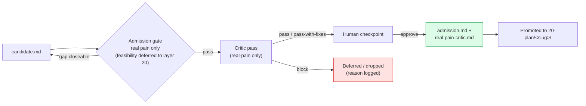

# 10 — Pain-Point

**Layer expertise.** Discover and validate real pain in AI-assisted heart-brain understanding.

**Mandate.** Surface candidate pain points (including creative, novel, out-of-box angles others have missed); validate the pain itself; admit on real-pain evidence; retire when downstream layers cancel or complete the work. Layer 10 deliberately does NOT pre-judge feasibility, solution shape, or defensibility — those are layer 20's and layer 30's jobs.

**Knowledge.** Domain literature, dataset issue trackers, practitioner forums (r/BCI, r/neuroscience, OpenBCI forum, PhysioNet discussions), benchmark leaderboards, clinician/patient narratives, lessons from cancelled or completed tracks.

**Help target.** Layer 00 (Vision).

## Layout

```
10-pain-point/
  README.md                          ← this file
  <slug>/                            ← one folder per investigated candidate
    candidate.md                     ← pain statement, constituency, evidence, counterfactual, open questions, gap-closing
    admission.md                     ← admission record (only present once admitted)
    real-pain-critic.md              ← critic's pass on the real-pain claim (only present once admitted)
  shared/
    portfolio.md                     ← registry of candidate / admitted / deferred / retired
    validation-log.md                ← chronological log of validation activities
    selection-shortlist.md           ← (historical, v1 rubric) cross-candidate comparison
    critic-shortlist.md              ← (historical) critic pass on the v1 shortlist
    critic-defensibility.md          ← (historical) negative-result defensibility critic, now advisory
```

## Admission flow



Admission is per-candidate. Multiple admissions over time = portfolio.

## Candidate spec

Each `<slug>/candidate.md` must contain:

1. **Pain point statement** — one paragraph, plain language.
2. **Constituency** — who feels it. Concretely. Not "the field".
3. **Evidence of pain** — citations, quotes, links. Multiple independent sources.
4. **Counterfactual** — what does the world look like if it's resolved?
5. **Open questions** — what could kill the candidate (knowledge gaps, not feasibility).

Optional, non-gating annotations (helpful for downstream layers): feasibility hint, quality-bar hint, reuse hint, defensibility note. Layer 20 makes the real calls on each.

After the broad survey, gap-closing passes append a `## Gap-closing <date>` section to the same `candidate.md`.

## Validation rubric (admission gate)

A candidate is admitted to the portfolio when:

- ≥ 2 independent evidence sources for the pain (not the same paper restated).
- Constituency named **and reachable in principle** — verified, not asserted.
- Critic pass returns `pass` or `pass-with-fixes` on the **real-pain claim** (not on feasibility, not on solution shape, not on defensibility).
- Human checkpoint approves admission.

Notably absent from the gate: feasibility, solution-shape, quality-bar plan, defensibility. Those are real concerns and belong to the layers that have to do the work. Layer 20 may cancel a track if methodology is infeasible at our envelope; layer 30 may cancel if data turns out inaccessible or if results turn out to have no informative direction. Each cancel signal returns here as a `retire-cancelled` portfolio update.

This is a deliberate loosening: we want the portfolio open to creative / novel / out-of-box framings of pain that a strict feasibility filter at admission time would prematurely kill.

## Portfolio operations

- **Sequencing.** Tracks may run in parallel when compute / time / data don't collide, or sequential when one's output is upstream of another's. Default to sequential first to establish shared substrate; subsequent tracks parallel once `30-implement/shared/` is meaningful.
- **Retire-cancelled vs retire-completed.** Both are valid. Cancellations feed lessons back into the candidate file and (where relevant) into the next round of scouting.
- **Recurring scout.** Layer 10 should periodically re-survey for new pain points (new literature, new constituencies, lessons from cancelled tracks). The portfolio is a living set.
- **Cross-track reuse.** Before a new candidate enters layer 20, the methodologist surveys `30-implement/shared/` for substrate that already addresses parts of the planned work.

## Critic pass

A separate agent invocation reviews each admission against the candidate spec on the **real-pain dimension only**. The critic does NOT block on feasibility, solution shape, defensibility, or reuse leverage; those are advisory notes only. Critic report saved as `<slug>/real-pain-critic.md`.

