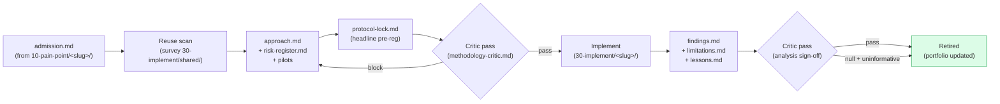

# 20 — Plan

**Layer expertise.** Connect pain to technical. Design the work and interpret it once results land.

**Mandate.** Translate an admitted pain point into a concrete, feasible technical approach (`approach.md`), pre-register the headline (`protocol-lock.md`), enumerate risks with kill criteria (`risk-register.md`), and — once the implementation layer produces results — interpret them honestly (`findings.md`, `limitations.md`, `lessons.md`). Layer 20 OWNS the feasibility check that layer 10 deferred: if no approach in the design space fits our envelope, retire-cancel the track with a documented reason.

**Knowledge.** Admission record (`10-pain-point/<slug>/admission.md`), public datasets, OSS biosignal stacks (MNE-Python, NeuroKit2, BioSPPy, sklearn, PyTorch, HuggingFace), recent literature, the layer's own `shared/` (reuse sketches, cross-track design notes), and the implementation layer's `shared/` (substrate to consume from / contribute to).

**Help target.** Layer 10 (Pain-Point) — for the admitted slug.

## Layout

```
20-plan/
  README.md                          ← this file
  <slug>/                            ← one folder per admitted pain point
    approach.md                      ← chosen approach: data, model family, eval, ablations, uncertainty, shared substrate, novelty notes
    risk-register.md                 ← risks, mitigations, kill criteria, retire-cancel triggers
    protocol-lock.md                 ← pre-registered headline experiment (frozen before any headline run)
    methodology-critic.md            ← critic pass at the 20→30 help boundary
    pilots-README.md                 ← pilot probes (fast, dev-split only, not pre-registered)
    findings.md                      ← (post-headline) what we learned; null is a finding
    limitations.md                   ← (post-headline) what the result does not show
    lessons.md                       ← (post-headline) what generalises; candidates for shared/ promotion
  shared/
    reuse-sketches/                  ← per-candidate cross-track-leverage sketches (pre-admission planning aid)
```

`findings.md` / `limitations.md` / `lessons.md` materialize after the implementation layer returns headline results. They are not pre-created.

## Stance

- **Novelty welcome.** Try novel / creative / out-of-box approaches before defaulting to standard ones.
- **Pilot vs headline.** Pilot probes (small, fast, dev-split only, **not** pre-registered) are encouraged to inform open design choices. Pre-register only the headline experiment in `protocol-lock.md`. Once locked, only the headline runs against the held-out partition.
- **Cancel-back is healthy.** If no approach fits the envelope, retire-cancel — that's a real outcome and produces lessons.
- **Within-layer agile, cross-layer gated.** Iterate fast on `approach.md` until critic-pass; locked protocol does not change silently.

## Plan → execute → interpret flow



Pre-registration discipline: `protocol-lock.md` is frozen before the headline runs in 30. Pilots remain dev-split only. The held-out partition is touched exactly once for the headline.

## Reuse-first design

Before drafting `approach.md`:

1. Read `30-implement/README.md` and survey `30-implement/shared/data/`, `30-implement/shared/eval/`, `30-implement/shared/models/`.
2. Identify reusable-as-is, reusable-with-extension, and gaps.
3. Decide what this track will **consume** from `30-implement/shared/`, what it will **promote** to `30-implement/shared/`, and what is genuinely track-specific.

Document these decisions in `approach.md` under a **Shared substrate** section.

## Critic gates

- After `protocol-lock.md` is drafted, before headline runs: critic pass at the 20 → 30 boundary. Locked protocol must not be modified silently — changes require an explicit unlock note + critic re-pass.
- After `findings.md` is drafted, before retirement: critic pass on analysis sign-off (interpretation, limitations, what is and isn't claimed).
