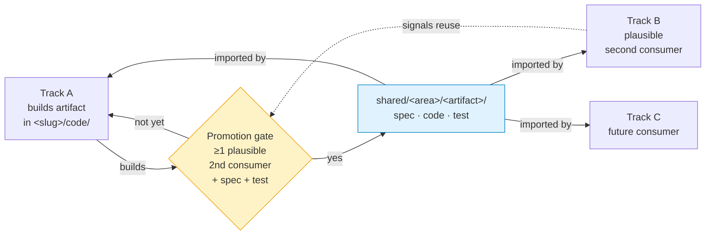

# 30 — Implement

**Layer expertise.** Technical execution. Code, data, runs, results.

**Mandate.** Execute the locked protocol from `20-plan/<slug>/protocol-lock.md`. Produce honest results. May cancel-back to layer 20 (re-design) or layer 10 (retire-cancel) if the locked protocol turns out infeasible at run-time.

**Knowledge.** Frozen protocol from layer 20, this track's code, the shared substrate (`30-implement/shared/`), the compute envelope (`30-implement/compute.md`), and the public dataset registry (`30-implement/datasets.md`).

**Help target.** Layer 20 (Plan) — for this track.

## Layout

```
30-implement/
  README.md                          ← this file
  compute.md                         ← binding compute envelope + track-specific opt-in fallbacks
  datasets.md                        ← public dataset registry
  <slug>/                            ← one folder per running track
    code/                            ← reproducible scripts / notebooks; imports from shared/
    runs/                            ← run logs, metrics, configs (large artifacts gitignored)
    results.md                       ← primary metrics on held-out, ablations, uncertainty, failure modes
  shared/
    README.md                        ← promotion rule + current state
    data/                            ← dataset loaders, partition utilities, cohort stratifiers, leakage detectors
    eval/                            ← metric computers, calibration tools, uncertainty wrappers, abstention protocols
    models/                          ← baseline implementations (Riemannian, 1D-ResNet, classical-feature pipelines, frozen-feature heads)
```

`<slug>/`, `30-implement/shared/data/`, `30-implement/shared/eval/`, `30-implement/shared/models/` materialize lazily — don't pre-create empty dirs.

## Discipline (per project quality bar — applies to the headline only)

- Held-out partition touched **once** for the headline number. Pilots and debugging use dev split only.
- Every reported headline metric carries an uncertainty estimate (CI, std across seeds, or bootstrap).
- Ablations cover the design choices most likely to be load-bearing (named in `20-plan/<slug>/protocol-lock.md`).
- Failure cases catalogued, not buried.

## Pilots vs headline

Pilots from `20-plan/<slug>/pilots-README.md` may be re-run here at scale to inform pre-protocol-lock tweaks. Once the locked protocol exists, only the locked headline runs against the held-out partition. Anything else stays on dev split.

## Promotion to shared/



- An artifact lives in a track until it has ≥1 plausible second consumer. Then promote.
- Promotion = move to `shared/<area>/<artifact>/`, write a spec (`README.md`: what it does, inputs/outputs, dependencies, tested-on), update the originating track's imports.
- A promoted artifact must come with at least one test or demo so a downstream track can verify it works in their environment.

## Cancel-back

- Methodology proves infeasible at run-time (data inaccessible, dependency unavailable, OOM at smallest viable config) → return to layer 20 with a re-design ask. If no re-design recovers, escalate to layer 10 as `retire-cancelled`.
- Headline returns a result that has no informative direction (underpowered, dataset misaligned with the question) → layer 20's analysis pass calls it out; layer 10 logs `retire-cancelled`.

