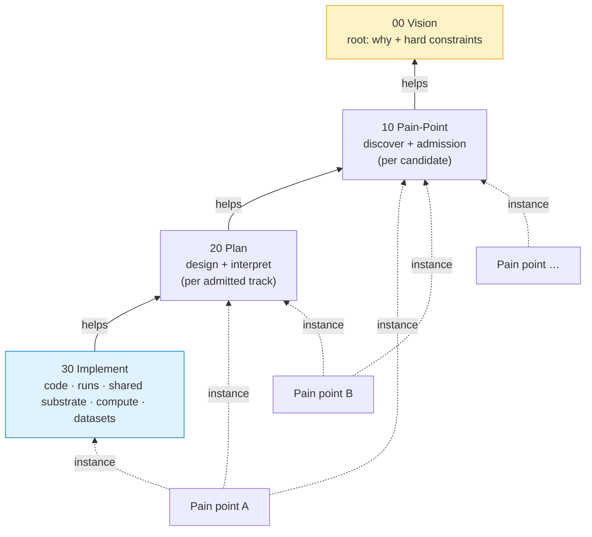

# AHBU — agent operating notes

How this project is structured and operated. For the WHY, read `00-vision/README.md`. For 30-second orientation, read `README.md`.

## Architecture



Solid arrows = help relations (Layered Endeavor Framework). A pain point exists as a folder inside whichever layers it has reached. Each layer also owns a `shared/` subfolder for layer-scoped substrate that doesn't belong to any single pain point.

## Repo layout

```
00-vision/
  README.md                              # vision, hard constraints, stance

10-pain-point/                           # discover + validate pain
  README.md
  <slug>/                                # one folder per investigated candidate
    candidate.md                         # pain statement, evidence, gap-closing notes
    admission.md                         # admission record (only once admitted)
    real-pain-critic.md                  # critic pass on real-pain claim
  shared/
    portfolio.md                         # registry: candidate / admitted / deferred / retired
    validation-log.md                    # chronological log
    selection-shortlist.md               # historical (v1 rubric)
    critic-shortlist.md                  # historical (v1 rubric)
    critic-defensibility.md              # historical (v1 rubric, now advisory)

20-plan/                                 # pain → technical: design + interpret
  README.md
  <slug>/                                # one folder per admitted track
    approach.md                          # data, model, eval, ablations, uncertainty, novelty
    risk-register.md                     # risks, mitigations, kill criteria, retire-cancel triggers
    protocol-lock.md                     # pre-registered headline (frozen)
    methodology-critic.md                # critic at 20→30 boundary
    pilots-README.md                     # pilot probes (dev-only, not pre-registered)
    findings.md                          # post-headline interpretation
    limitations.md                       # post-headline honest limitations
    lessons.md                           # post-headline; promotion candidates for shared/
  shared/
    reuse-sketches/                      # per-candidate cross-track-leverage sketches

30-implement/                            # technical execution
  README.md
  compute.md                             # binding compute envelope + opt-in fallbacks
  datasets.md                            # public dataset registry
  <slug>/                                # one folder per running track (lazy)
    code/                                # reproducible scripts
    runs/                                # logs, metrics, configs
    results.md                           # primary metrics, ablations, uncertainty
  shared/                                # lazy materialize
    data/                                # loaders, partition utilities, leakage detectors
    eval/                                # metrics, calibration, abstention, uncertainty wrappers
    models/                              # baselines (Riemannian, 1D-ResNet, classical pipelines)

bin/                                     # repo tooling (transcript sync, hooks)
transcripts/                             # raw sub-agent JSONL (auto-synced pre-commit)
.claude/agents/                          # agent personas
```

Each layer's `README.md` declares **layer expertise, mandate, knowledge, output, help target, layout, stance**. Don't reach across layers — flow goes through help relations.

## Hard-constraint enforcement (layer routing)

The three hard constraints declared in `00-vision/README.md` are not all enforced at the same layer. Each is enforced where it can actually be verified:

| Constraint | Enforced at | Mechanism |
|---|---|---|
| Pain point real | Layer 10 (admission gate) | Real-pain critic pass + human checkpoint. Failing → don't admit. |
| Solution feasible | Layer 20 (plan) | Methodology design must fit our envelope. Failing → retire-cancel back to layer 10. NOT pre-judged at admission — pre-judging filters out creative framings before they get a real look. |
| Quality bar | Layer 20 (protocol pre-reg + analysis sign-off) + Layer 30 (execution) | Layer 20 designs the protocol that meets it; layer 30 executes; layer 20 interprets honestly post-headline. Failing at any → retire-cancel back to layer 10. |

Both `retire-completed` and `retire-cancelled` are valid portfolio exits. Both produce lessons.

## Operating discipline

- **Critic pass** required at each help-boundary milestone (admission, protocol-lock, results sign-off, analysis sign-off). Use `.claude/agents/critic.md` persona via Agent tool or as a teammate.
- **Human checkpoint** at end of each meaningful chunk. Don't barrel through admission → planning → implementation without check-in.
- **Pain-point validation = required artifact** for every admission. No `20-plan/<slug>/` exists without `10-pain-point/<slug>/admission.md`.
- **Reuse first.** Methodology designers must scan `30-implement/shared/` before drafting `approach.md`. Promote eagerly to `shared/` once ≥1 plausible second consumer exists.
- **Use git.** Commit as you go. Tag milestones: `v0-vision`, `v1-shortlisted`, `v2-<slug>-admitted`, `v3-<slug>-protocol-locked`, `v4-<slug>-results`, `v5-<slug>-retired`. Branches encouraged for parallel tracks.

### Within-layer agile, cross-layer gated

- Within a layer, iterate fast: cheap drafts, pilots, probes, scratch experiments. The cost of wrong inside a layer is low.
- At layer boundaries, gate strictly: critic pass + human checkpoint. The cost of advancing wrong work to the next layer is high.

This is the operational form of the vision's "efficiency over ceremony" stance.

### Spec convention

Every work artifact in every layer starts with a one-line `> **Spec:** <path>` quote naming the upstream artifact whose mandate it serves. Makes the help relation traceable at file granularity (not only at layer-README granularity). Per-file mapping:

| File | Spec |
|---|---|
| `10-pain-point/<slug>/candidate.md` | `10-pain-point/README.md` (candidate spec section) |
| `10-pain-point/<slug>/admission.md` | `00-vision/README.md` (hard constraint #1: pain real and validated) + `10-pain-point/README.md` (validation rubric) |
| `10-pain-point/<slug>/real-pain-critic.md` | `<slug>/candidate.md` (under review) + `10-pain-point/README.md` (rubric the critic applies) |
| `20-plan/<slug>/{approach,risk-register,protocol-lock}.md` | `10-pain-point/<slug>/admission.md` |
| `20-plan/<slug>/pilots-README.md` | `<slug>/approach.md` |
| `20-plan/<slug>/methodology-critic.md` | `<slug>/{approach,risk-register,protocol-lock}.md` (under review) + `10-pain-point/<slug>/admission.md` (the spec layer 20 received) |
| `20-plan/<slug>/{findings,limitations,lessons}.md` *(post-headline)* | `30-implement/<slug>/results.md` + `<slug>/protocol-lock.md` |
| `30-implement/<slug>/code/README.md` | `20-plan/<slug>/approach.md` |
| `30-implement/<slug>/code/pilots/p*.py` | `20-plan/<slug>/pilots-README.md#P-N` (in module docstring; also surfaced in JSON `spec` field) |
| `30-implement/<slug>/code/headline/*.py` | `20-plan/<slug>/protocol-lock.md` |
| `30-implement/<slug>/results.md` | `20-plan/<slug>/protocol-lock.md` |
| `30-implement/shared/<area>/<artifact>/README.md` | the originating-track promotion event + the second-consumer that triggered promotion |

### Pilot vs headline (per track, layer 20 + 30)

- **Pilots:** small, fast, exploratory. Listed in `20-plan/<slug>/pilots-README.md`; executed by `30-implement/<slug>/code/` against the dev split. Not pre-registered.
- **Headline:** the experiment that supports the track's primary claim. Pre-registered in `20-plan/<slug>/protocol-lock.md` before it runs. Touches the held-out partition exactly once, in `30-implement/<slug>/`.

Pilots feed methodology; headline feeds analysis. Don't conflate them.

## Quality bar (cross-cutting, applies to every track)

- Honest held-out testing. Held-out touched once for the headline.
- Uncertainty reported on every metric.
- Ablations on load-bearing design choices.
- Failure modes characterized, not buried.
- No metric gaming, no cherry-picking, no hand-waving.

If meeting the quality bar with the chosen approach is impossible, that is itself a finding — surface it, don't paper over.

## Resources

`30-implement/compute.md` — binding compute envelope (currently GTX 1650 4 GB) + track-specific opt-in fallbacks (e.g., Kaggle T4 for FM feature extraction).
`30-implement/datasets.md` — public dataset registry.

## Agent team

`CLAUDE_CODE_EXPERIMENTAL_AGENT_TEAMS=1` enabled in `.claude/settings.local.json`. Use **agent teams** (peer-to-peer + shared task list) for phases that benefit from cross-challenge / parallel exploration — admission gap-closing, methodology debate, parallel-track work, ablation runs. Use plain subagents (Agent tool) for one-shot lookups.

Defined personas in `.claude/agents/`:

- `pain-point-researcher` — surveys constituencies + literature for evidence of real pain. Operates in layer 10.
- `critic` — adversarial review at help boundaries.
- `methodologist` — designs the approach in layer 20; reuse-scan against `30-implement/shared/` first.

Spawn additional teammates (data-plumber, baseline-builder, ablation-runner, writer, shared-promoter) when work calls for it.

Env-var changes take effect on **next session**. Restart before agent-team commands become available.

## Transcripts

Every sub-agent JSONL transcript is auto-synced from `~/.claude/projects/<project>/<session>/subagents/` into `transcripts/` via the `bin/sync-transcripts.ps1` script, wired as a git pre-commit hook by `bin/install-hooks.ps1`. Manifest at `transcripts/MANIFEST.md` maps agentId → persona/task.

## Kickoff for fresh session

1. Read `00-vision/README.md` and the four layer READMEs.
2. Read `10-pain-point/shared/portfolio.md` for active state.
3. Pick up the next chunk per the active track's layer:
   - At layer 10 → real-pain-researcher closes any open gaps in `<slug>/candidate.md`; critic does real-pain pass; admission record drafted.
   - At layer 20 → methodologist drafts `approach.md` + `risk-register.md` + `protocol-lock.md`; critic at 20→30 boundary; pilots designed.
   - At layer 30 → execute pilots first (dev-only); execute headline once locked; results to `<slug>/results.md`.
   - Back at layer 20 → interpret in `findings.md` + `limitations.md` + `lessons.md`; critic on analysis sign-off.
