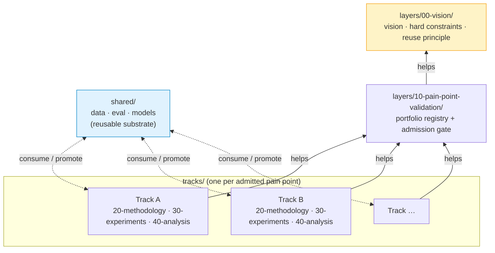

# AHBU project — agent operating notes

This is the AI-Assisted Heart-Brain Understanding endeavor. See `README.md` for the charter and `layers/00-vision/README.md` for the vision and hard constraints.

The project is a **portfolio**, not single-shot. Multiple pain points may run sequentially or in parallel. Reuse across them is first-class.

## Architecture at a glance



Solid arrows = help relations (Layered Endeavor Framework). Dashed lines = sharing channel (no responsibility, just artifact flow). Vision is root; everything aligns transitively.

## How this repo is structured

```
layers/                   # project-level (apply across all tracks)
  00-vision/              # root. vision, hard constraints, reuse principle.
  10-pain-point-validation/   # portfolio mgmt: candidates, validation, admission.
    candidates/           # one .md per investigated candidate
    portfolio.md          # registry: candidate / admitted / deferred / retired
    admission/<slug>.md   # admission record (critic + human checkpoint)
    validation-log.md
    critic-shortlist.md   # current critic pass on shortlist
    selection-shortlist.md  # comparison across candidates

shared/                   # cross-track reusable substrate
  data/  eval/  models/   # promoted artifacts; ≥1 plausible 2nd consumer required

tracks/                   # one dir per admitted pain point
  _template/              # copy this to instantiate a new track
  <slug>/
    README.md             # track summary + status
    20-methodology/       # approach.md, risk-register.md, protocol-lock.md
    30-experiments/       # code/, runs/, results.md
    40-analysis/          # findings.md, limitations.md, next.md, lessons.md

resources/                # compute.md, datasets.md (project-level)
.claude/agents/           # personas: pain-point-researcher, critic, methodologist
```

Each layer / track-layer `README.md` declares **mandate, knowledge, output, help target**. Don't reach across layers — flow goes through help relations.

## Operating discipline

- **Critic pass** required at each help-boundary milestone (admission, protocol-lock, experiments sign-off, analysis sign-off). Use `.claude/agents/critic.md` persona via Agent tool or as a teammate.
- **Human checkpoint** at end of each meaningful chunk. Don't barrel through admission → methodology → experiments without check-in.
- **Pain-point validation = required artifact** for every admission. No track instantiates without admission record.
- **Hard constraints** (per pain point, non-negotiable) are distributed across layers, not all enforced at admission:
  - Real validated pain → enforced at layer 10 (admission gate).
  - Feasible solution → enforced at layer 20 (methodology). Layer 20 may cancel a track that turns out infeasible at our compute envelope. NOT pre-judged at admission.
  - Honest evaluation → enforced at layers 20 / 30 / 40.
  Failing any at the layer that owns it → retire-cancelled (a valid outcome). Layer 10 deliberately keeps the portfolio open on real-pain alone, to avoid premature filtering of creative / novel framings.
- **Reuse first.** Methodology designers must scan `shared/` before drafting `approach.md`. Promote eagerly to `shared/` once ≥1 plausible second consumer exists.
- **Use git.** Commit as you go. Tag milestones: `v0-vision`, `v1-shortlisted`, `v2-<slug>-admitted`, `v3-<slug>-protocol-locked`, `v4-<slug>-results`, `v5-<slug>-retired`. Branches encouraged for parallel tracks.

## Agent team

`CLAUDE_CODE_EXPERIMENTAL_AGENT_TEAMS=1` enabled in `.claude/settings.local.json`. Use **agent teams** (peer-to-peer + shared task list) for phases that benefit from cross-challenge / parallel exploration — admission gap-closing, methodology debate, parallel-track work, ablation runs. Use plain subagents (Agent tool) for one-shot lookups.

Defined personas in `.claude/agents/`:

- `pain-point-researcher` — surveys constituencies + literature for evidence of real pain.
- `critic` — adversarial review at help boundaries.
- `methodologist` — designs concrete approach after admission; reuse-scan first.

Spawn additional teammates (data-plumber, baseline-builder, ablation-runner, writer, shared-promoter) when work calls for it.

Env-var changes take effect on **next session**. Restart before agent-team commands become available.

## Kickoff for fresh session (admission gap-closing)

After session restart with agent teams active:

1. Read `layers/10-pain-point-validation/{portfolio.md, selection-shortlist.md, critic-shortlist.md}` and all `candidates/*.md`.
2. Spawn team:
   - `pain-point-researcher` × 1 — close verification gaps for top candidates (constituency outreach attempts, dataset license/skin-tone-label verification, selective-classification literature check, EEG-FM-Bench scope re-examination).
   - `critic` × 1 — pressure-test each candidate's negative-result defensibility.
   - `methodologist` × 1 — sketch reuse-aware approach per top candidate (what enters `shared/`).
   - Lead = orchestrator.
3. Shared task list: per top candidate × {close-gaps, defensibility, reuse-sketch}. Teammates self-claim.
4. Converge on first admission. Write `layers/10-pain-point-validation/admission/<slug>.md`. Update `portfolio.md`.
5. Human checkpoint before instantiating `tracks/<slug>/`.
6. After admission: copy `tracks/_template/` → `tracks/<slug>/`, methodology phase begins. Reuse-scan against `shared/` (empty on first track — promotion candidates surface here).

## Resource picture

`resources/compute.md`. Binding constraint: 4 GB VRAM. Plan accordingly.

## Quality bar (cross-cutting, applies to every track)

- Honest held-out testing. Held-out touched once for the headline.
- Uncertainty reported on every metric.
- Ablations on load-bearing design choices.
- Failure modes characterized, not buried.
- No metric gaming, no cherry-picking, no hand-waving.

If meeting the quality bar with the chosen approach is impossible, that is itself a finding — surface it, don't paper over.
