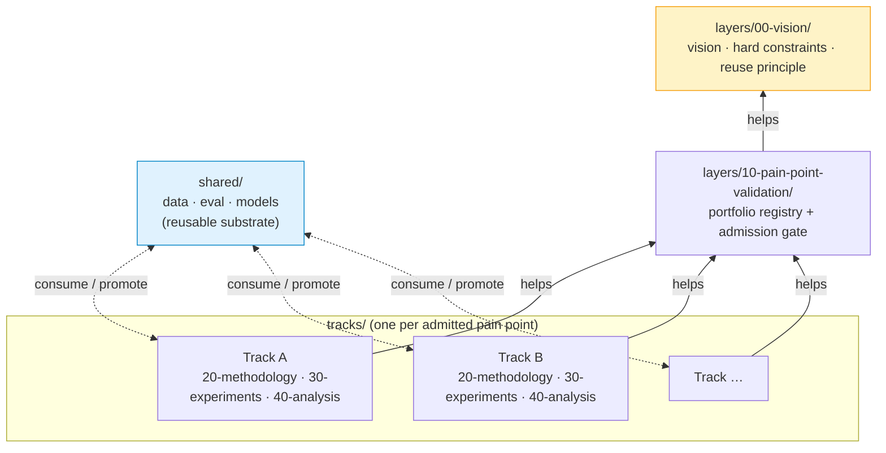

# AI-Assisted Heart-Brain Understanding

Autonomous project charter. The organizing philosophy is the Layered Endeavor Framework — read it before doing anything else:

https://raw.githubusercontent.com/zzyy-gh/alibrary/main/inbox/layered-endeavor-framework.md

This README adds only what's specific to this project; the framework covers the rest.

## Architecture at a glance

Solid arrows = help relations (Layered Endeavor Framework). Dashed lines = sharing channel (no responsibility, just artifact flow). Vision is root; everything aligns transitively.

## Vision

Resolve real pain points in AI-assisted heart-brain understanding — the use of physiological signals (heart and brain) to infer body state, mental state, or intent.

This is a **portfolio**, not a single-shot project. Multiple pain points may be explored — sequentially or in parallel — and what is developed or learned on one (datasets, evaluation harnesses, baselines, calibration utilities, leakage diagnostics, modelling tricks) is expected to be reusable on others. Reuse is a first-class outcome, not a side-effect.

The portfolio is bounded by the quality bar, not by count. Better to carry one rigorously-validated pain point than five hand-wavy ones.

## Hard constraints (per pain point)

Every pain point admitted to the portfolio must meet these — no exceptions, no "we'll fix it later":

- **Pain point must be real.** Validate that some constituency (researchers, clinicians, BCI users, wearable developers, end users, model developers, and so on) actually feels the pain. Explore broadly before anchoring. No invented problems, no future-work-section hypotheticals. Document the validation. If you can't validate, drop the candidate or escalate.
- **Solution must be feasible.** Public data only, open-source tooling, compute you have access to, time horizon scoped at the start. If a candidate solution requires resources you don't have, it's out of scope.
- **Quality bar is non-negotiable.** Honest held-out testing, ablations where they matter, failure modes characterized, uncertainty reported. No metric gaming, no cherry-picking, no hand-waving.

A candidate that fails any of the three is dropped or deferred — not downgraded into the portfolio with caveats.

## Reuse principle

Anything produced inside one track that could plausibly serve another track gets surfaced as a **shared artifact** (in `shared/`) with its own small spec. Examples: a leakage-clean evaluation harness, a domain-shift diagnostic, a calibrated-abstention wrapper, a per-cohort stratifier, a baseline implementation. Tracks consume from `shared/`; tracks contribute back to `shared/`. The shared layer earns its keep when ≥2 tracks use the same artifact — promote eagerly but not prematurely.

## Project operations

The framework leaves operations to the project. For this one:

- **Critic at help boundaries.** Before declaring a milestone complete, run a critic pass — a separate agent invocation or structured self-review — against the spec the layer received. Looks for spec drift, unjustified shortcuts, missing validation, premature claims.
- **Human checkpoint at the end of each meaningful complete chunk.** Self-assess; when the chunk is right, hand over for review. Escalate sooner only when a hard constraint conflicts with the vision, a discovered fact changes the project's premise, or the chunk as scoped cannot meet the quality bar.
- **Pain-point validation is a required artifact** for every portfolio admission.
- **Portfolio discipline.** A registry (`layers/10-pain-point-validation/portfolio.md`) tracks candidate · admitted · deferred · completed pain points with reasons. Admission requires critic-pass + human checkpoint.
- **Use git.** Commit as you go. Tag milestones. Branches encouraged for parallel track work.

## Start

Read the framework. Establish your resource picture. Validate candidate pain points (broad before deep). Admit one or more to the portfolio. For each admitted pain point, instantiate a track from `tracks/_template/` and proceed through methodology → experiments → analysis. Surface reusable artifacts to `shared/` as they emerge.
