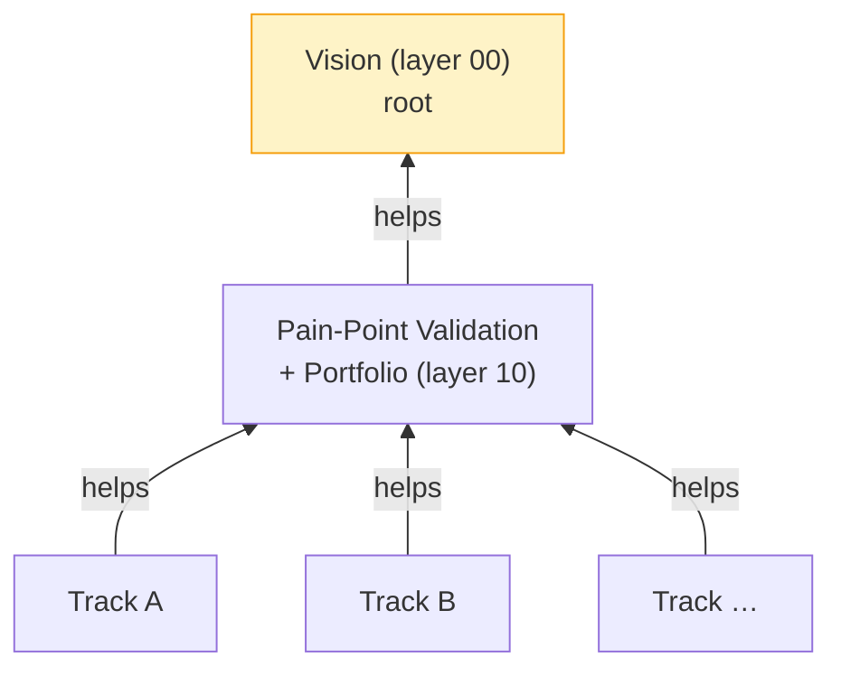

# Layer 00 — Vision (root)

**Mandate.** Define why this endeavor exists and what counts as success.

**Knowledge.** Founder intent (project README), the Layered Endeavor Framework, the broad domain of physiological-signal understanding (cardiac + neural).

**Output.** This document.

**Help target.** None (root).

---

## Endeavor tree (Layered Endeavor Framework view)

Vision is the root of alignment. Every track inherits its alignment to vision transitively through the portfolio layer (one-help rule). Cross-track sharing happens via `shared/` and is **not** a help relation — it is a sharing channel that does not carry responsibility.

## Why this endeavor exists

Resolve **real pain points** in AI-assisted heart-brain understanding — the use of physiological signals (heart and brain) to infer body state, mental state, or intent.

Domain spans (non-exhaustive): ECG / PPG / HRV; EEG / MEG / fNIRS; sleep staging; affective state inference; cognitive load; intent decoding (BCI); arrhythmia detection; biomarker discovery; cross-subject generalization; cross-dataset robustness; multimodal heart-brain fusion.

## Portfolio, not single-shot

The endeavor maintains a **portfolio** of pain points — explored sequentially or in parallel as resources permit. Every admission to the portfolio must independently pass the hard constraints below; the portfolio is gated by quality, not capped by count.

**Reuse is first-class.** Datasets, eval harnesses, baselines, calibration tools, leakage diagnostics, domain-shift probes — anything plausibly useful across tracks gets promoted into `shared/` with a small spec. Tracks consume from and contribute back to the shared layer. The reuse principle is one of the reasons the portfolio model is preferred over single-shot.

## Who we serve (candidate constituencies)

Researchers · clinicians · BCI users · wearable developers · end users (patients, consumers) · ML model developers working on biosignals.

The vision does not pre-commit to a constituency. The pain-point validation layer (10) admits constituencies into the portfolio one at a time, evidence-gated.

## Hard constraints (non-negotiable, per pain point)

Apply independently to every pain point admitted to the portfolio. Failing any → drop or defer; never downgrade with caveats.

1. **Pain-point real and validated.** Some constituency genuinely feels it; we have evidence.
2. **Solution feasible.** Public data, OSS tooling, available compute, scoped time horizon.
3. **Quality bar:** honest held-out testing · ablations where they matter · failure modes characterized · uncertainty reported. No metric gaming, no cherry-picking, no hand-waving.

If any constraint conflicts irreconcilably with progress: escalate, don't paper over.

## Resource picture (initial)

See `resources/compute.md`. Summary: GTX 1650 4 GB VRAM, Python 3.11, modest local compute. No large-scale training. Feasible regimes: classical ML, small DL models, fine-tuning small heads on pretrained features, careful evaluation.

## Project ops (delegated from README)

- Critic pass at every help boundary before milestone declared complete.
- Human checkpoint at end of each meaningful chunk (e.g., pain-point selection, methodology lock, first results).
- Pain-point validation = required artifact (layer 10).
- Git: commit as we go, tag milestones, branches for parallel exploration.

## Cross-cutting concerns entering at vision

- **Honesty / quality bar** (above) — propagates to every layer.
- **Reproducibility** — public data, deterministic seeds where possible, documented environment.
- **Scope discipline** — feasible > ambitious. Drop scope before dropping rigor.
