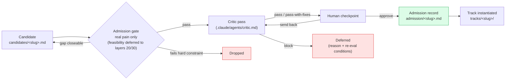

# Layer 10 — Pain-Point Validation & Portfolio Management

**Mandate.** Maintain the project's portfolio of pain points: surface candidates (including creative, novel, or out-of-box angles others have missed), validate the *pain* itself, admit on real-pain evidence, retire when downstream layers cancel or complete the work.

Layer 10 deliberately does NOT pre-judge feasibility, solution shape, or negative-result defensibility. Those are the responsibility of layers 20 / 30 / 40, which feed back to layer 10 with a cancel signal if the work is infeasible at our resources. Layer 10's job is to keep the portfolio open to genuinely felt pain — not to filter prematurely on what we *think* we can build.

**Knowledge.** Domain literature, dataset issue trackers, practitioner forums (r/BCI, r/neuroscience, OpenBCI forum, Sleep-EDF / PhysioNet discussions), benchmark leaderboards, clinician/patient narratives, and the project's accumulated learnings from earlier admitted tracks.

**Outputs.**
- `candidates/<slug>.md` — one file per investigated candidate (admitted or not).
- `validation-log.md` — chronological log of validation activities.
- `portfolio.md` — registry: candidate · admitted · deferred · retired, with reasons and dates.
- `admission/<slug>.md` — admission record per admitted track: critic-pass notes + human-checkpoint approval. Triggers track instantiation in `tracks/<slug>/`.

**Help target.** Layer 00 (Vision).

---

## Admission flow

Admission is per-candidate. Multiple admissions over time = portfolio.

## Candidate spec (template)

Each candidate file must contain:

1. **Pain point statement** — one paragraph, plain language.
2. **Constituency** — who feels it. Concretely. Not "the field".
3. **Evidence of pain** — citations, quotes, links. Multiple independent sources.
4. **Counterfactual** — what does the world look like if it's resolved? Why does that matter to the constituency?
5. **Open questions** — what could kill the candidate (knowledge gaps, not feasibility — feasibility is layer 20's job).

Optional, non-gating annotations (helpful but not required for admission):

- **Feasibility hint** — first-pass guess at compute / data envelope. Layer 20 makes the real call.
- **Quality-bar hint** — what honest evaluation might look like. Layer 20 commits to specifics.
- **Reuse hint** — plausible artifacts for `shared/`. Layer 20 commits to interfaces.
- **Defensibility note** — risk of negative result being uninformative. Layer 30 / 40 actually decides what to publish.

## Validation rubric (admission gate)

A candidate is admitted to the portfolio when:

- ≥ 2 independent evidence sources for the pain (not the same paper restated).
- Constituency named **and reachable in principle** — verified, not asserted (forum, paper authors, dataset maintainers, or at least one outreach attempt logged).
- Critic pass returns `pass` or `pass-with-fixes` on the **real-pain claim** (not on feasibility, not on solution shape, not on defensibility).
- Human checkpoint approves admission.

Notably absent from the gate: feasibility, solution-shape, quality-bar plan, defensibility. Those are real concerns, but they belong to the layers that actually have to do the work. Layer 20 may cancel a track if methodology is infeasible at our compute; layer 30 may cancel if data turns out inaccessible. Layer 40 may cancel if results turn out to have no informative direction. Each cancel signal returns to layer 10 as a `retire-cancelled` portfolio update.

This is a deliberate loosening: we want the portfolio open to creative / novel / out-of-box framings of pain that a strict feasibility filter at admission time would prematurely kill. The cost is some wasted layer-20 effort on tracks that turn out infeasible. We accept that cost in exchange for not screening out ambition.

## Portfolio operations

- **Sequencing.** Tracks may run in parallel when their compute / time / data demands don't collide, or sequential when one's output is upstream of another's. Default to sequential first track to establish substrate; subsequent tracks can run parallel once `shared/` is meaningful.
- **Retire-cancelled vs retire-completed.** A track may exit the portfolio either by completing its analysis layer (`retire-completed`) or by being cancelled from layers 20 / 30 / 40 with a documented reason (`retire-cancelled`). Both are valid outcomes. Cancellations feed lessons back into the candidate file and (where relevant) into the next round of broad-survey scouting.
- **Recurring scout.** Layer 10 should periodically re-survey for new pain points (new literature, new constituencies, lessons from cancelled tracks). The portfolio is a living set, not a one-shot intake.
- **Cross-track reuse.** Before a new track designs methodology, it surveys `shared/` for components that already address parts of its plan. The methodologist agent is responsible for this scan.

## Critic pass

A separate agent invocation reviews each admission against the candidate spec on the **real-pain dimension only** — evidence quality, constituency reachability, plain-language pain statement. The critic does NOT block on feasibility, solution shape, defensibility, or reuse leverage; those are advisory annotations the critic may surface but cannot gate on. Critic notes recorded in `admission/<slug>.md`.
