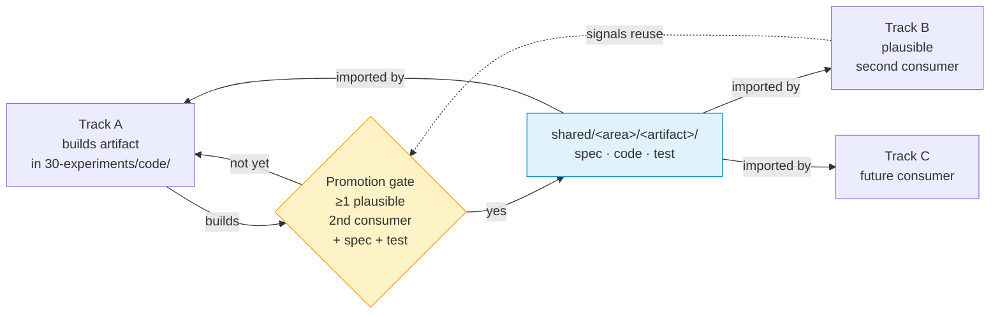

# Shared substrate

Cross-track reusable artifacts. Tracks consume from here and contribute back here.

## Purpose

The portfolio model expects reuse to be first-class. Without a shared layer, each track reinvents data loaders, eval harnesses, calibration tools, leakage diagnostics, and baselines. With a shared layer, the second track is faster than the first, the third faster than the second, and the project accumulates engineering leverage.

## Promotion flow

## Promotion rule

- An artifact lives in a track until it has ≥1 plausible second consumer. Then promote.
- Promotion = move to `shared/<area>/<artifact>/`, write a spec (`README.md`: what it does, inputs/outputs, dependencies, tested-on), update the originating track's imports.
- A promoted artifact must come with at least one test or demo notebook so a downstream track can verify it works in their environment without re-deriving the original use case.

## Layout

- `shared/data/` — dataset loaders, partition utilities, cohort stratifiers, leakage detectors.
- `shared/eval/` — metric computers, calibration tools (Brier, ECE, reliability diagrams), uncertainty wrappers (bootstrap, multi-seed), abstention / selective-classification protocols, held-out partition validators.
- `shared/models/` — baseline implementations (Riemannian + MDM for EEG, 1D-ResNet for ECG, classical-feature pipelines, frozen-feature heads on pretrained backbones).

Add areas as needed. Do not pre-create empty areas.

## Anti-patterns

- Promoting prematurely (one consumer, no spec) — bloats the layer with not-quite-reusable code.
- Promoting late (third track copy-pasted before promotion) — defeats the point.
- Hidden coupling — a `shared/` artifact must not silently depend on a track's code path. If it does, the dependency is project-level and belongs in `shared/`.

## Current state

_Empty. First track's methodology will populate this layer when its `approach.md` flags promotion candidates._
