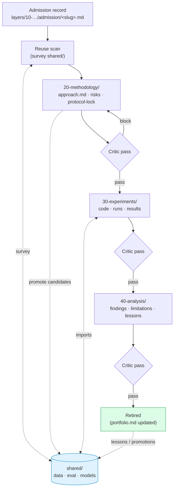

# Track template

Each admitted pain point becomes a track in `tracks/<slug>/`, instantiated by copying this template.

## What a track is

A track is the concrete pursuit of one admitted pain point, organized through the layers Methodology (20) → Experiments (30) → Analysis (40). Within a track the Layered Endeavor Framework applies: each layer has its mandate, knowledge, output, and help target.

The pain-point validation layer (10) and the vision (00) are project-level, not per-track. They sit one level up.

## Track lifecycle (diagram)

Each critic gate is a help-boundary milestone. Reuse-scan happens before methodology drafts; promotion happens any time an artifact gains a plausible second consumer.

## Track lifecycle

1. **Instantiation.** Copy `tracks/_template/` to `tracks/<slug>/`. Set the slug from `layers/10-pain-point-validation/admission/<slug>.md`.
2. **Methodology** (20-methodology/). Methodologist agent. Output: `approach.md`, `risk-register.md`, `protocol-lock.md`. Critic pass before lock.
3. **Experiments** (30-experiments/). Implementation, runs, results. Held-out touched once.
4. **Analysis** (40-analysis/). Findings, limitations, next steps. Critic pass before sign-off.
5. **Retirement.** Update portfolio registry. Surface lessons to `shared/` or `tracks/<slug>/lessons.md`.

## Pre-methodology reuse scan

Before methodology design begins, the methodologist surveys `shared/` for components that address parts of the planned approach (eval harness, calibration utility, dataset loader, baseline). Reuse over reinvention. New work that should belong in `shared/` is flagged for promotion at design time, not after-the-fact.

## Track-level files

- `README.md` — this file (per-track instance: brief track summary + status).
- `20-methodology/` — methodology layer.
- `30-experiments/` — experiments layer.
- `40-analysis/` — analysis layer.
- `lessons.md` — written at retirement; what generalises, what doesn't, what to do differently next track.

## Cross-track help relations

A track helps **the project's portfolio (layer 10)** by demonstrating that the admitted pain point is resolvable (or that it is not — a negative result is also a contribution). A track does not help another track directly; cross-track flow is mediated by `shared/`.
